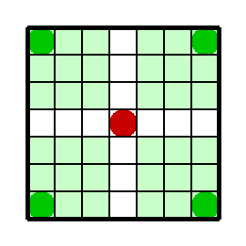

# RL-Pursuit-Game

Git repository of our project code : the RL-Pursuit-Game

##  What are the files ?

- backend.py : deprecated file

- back\_single\_agent_v2.py : deprecated file

- back\_single\_agent_v3.py : contains the main environment with the grid, the actors, their actions and movements, the rewards, and a default random agent

- q_learning.py : contains the training algorithms using q-functions (SARSA and Q-Learning)

- visualization.py : enables the animated display of the situation

## How to launch the code ?

Download all the non-deprecated python files in a folder and directly launch the execution of "q_learning.py"

## Some fancy results :

